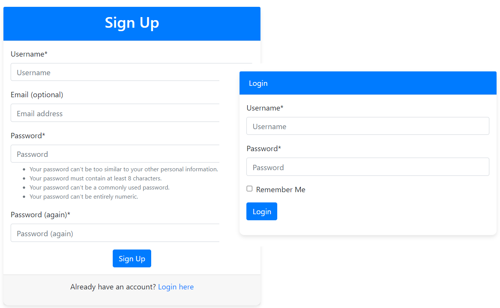
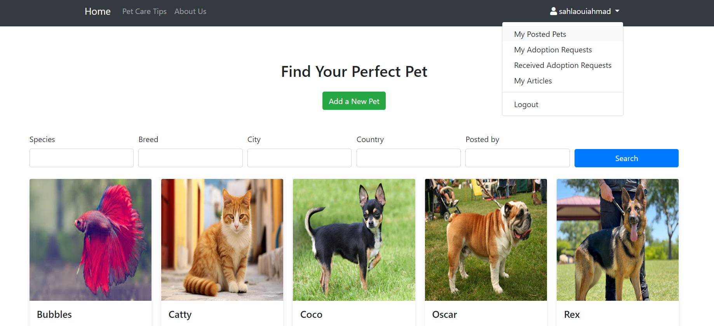
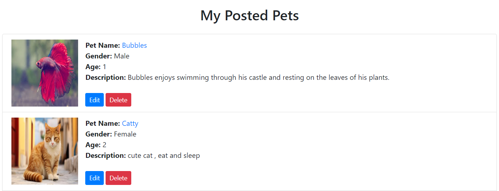
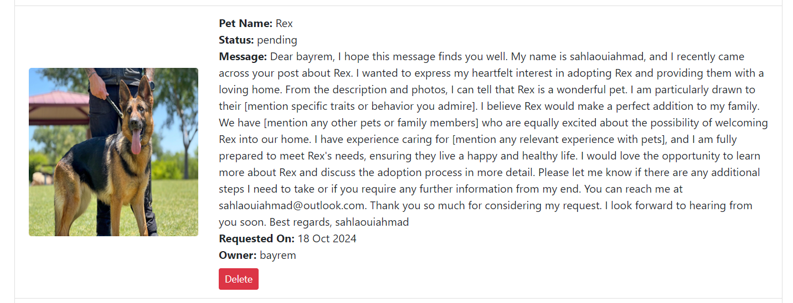
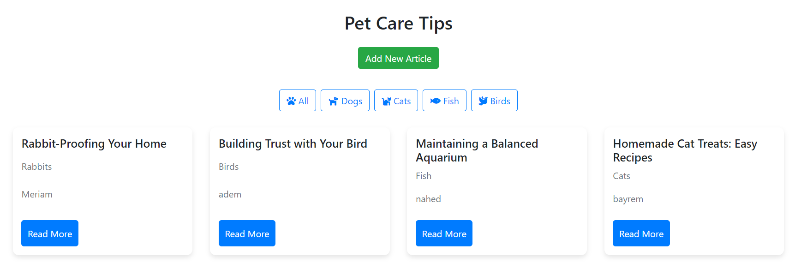
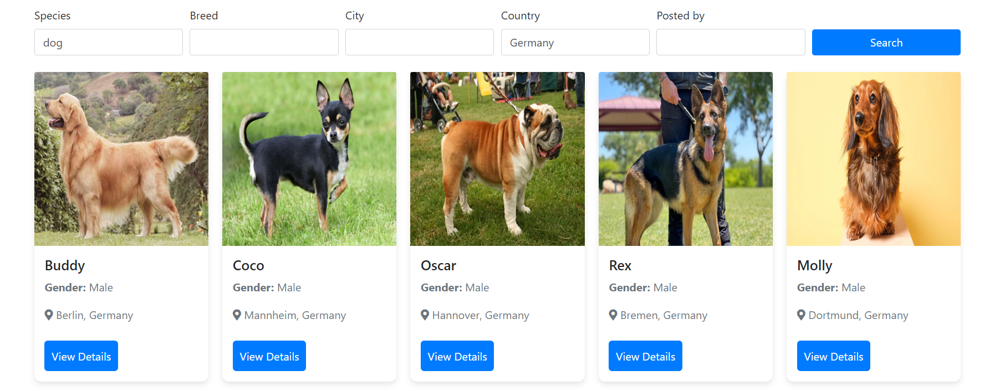
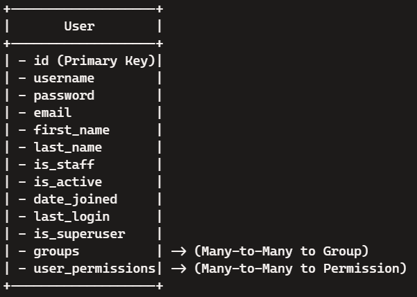
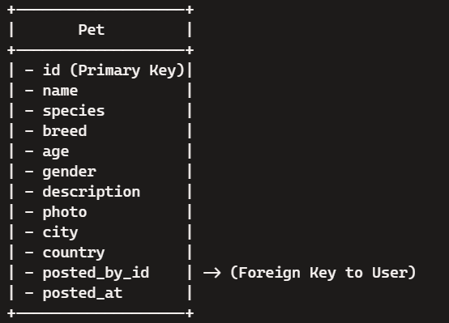
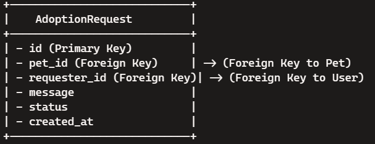
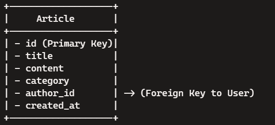

# Adopets Platform

Welcome to Adopets Platform, your go-to solution for pet adoption! Our platform is designed to simplify and enhance the pet adoption process, making it easier for potential adopters to connect with pet owners. With Adopets, finding a loving home for every pet is just a few clicks away. Whether you're looking to adopt a pet or rehome a pet, our user-friendly interface and powerful search capabilities ensure a seamless experience for all users.

Additionally, explore our comprehensive library of pet care articles to provide the best for your new furry friends. Share your experiences, tips, and stories with other pet lovers in our community, and learn from others' experiences to make the journey of pet adoption even more rewarding.

Our website is deployed on Heroku. Check it out [here](https://adopetsplatform-4e35c86a8c8e.herokuapp.com/).

## Key Features

### Posting Pets
Easily post pets available for adoption on our platform. Provide detailed information, including photos, breed, age, and any special requirements. This helps potential adopters find the perfect match quickly and efficiently.

### Adoption Requests
Manage adoption requests seamlessly. Potential adopters can express their interest in adopting pets, and pet owners or shelters can review and respond to these requests. Our streamlined process ensures a smooth and transparent adoption experience for everyone involved.

### Research Using Filters
Find the ideal pet using our powerful search filters. Filter by species, breed, age, location, and more to narrow down your options and find pets that match your preferences. Our intuitive search functionality makes it easy to discover pets that are looking for a loving home.

### Account Creation
Sign up and create an account to start using the Adopets Platform. Whether you're a pet owner looking to rehome a pet or a potential adopter searching for a new companion, having an account allows you to manage your listings, adoption requests, and communication with ease.

### Articles of Pet Care
Explore our comprehensive library of articles on pet care. From feeding tips to grooming guides, our articles are designed to help pet owners provide the best care for their furry friends. Stay informed and ensure your pets are happy and healthy with our expert advice.

## Technologies Used

### Django
Django is the backbone of our platform. It’s a high-level Python web framework that encourages rapid development and clean, pragmatic design. Django takes care of much of the hassle of web development, allowing us to focus on writing your app without needing to reinvent the wheel. 

### PostgreSQL
We use PostgreSQL as our database management system. It’s a powerful, open-source object-relational database system that has earned a strong reputation for reliability, feature robustness, and performance.

### JavaScript
JavaScript powers the interactive elements of our site, ensuring a smooth and dynamic user experience. It's an essential technology for making our web pages more engaging and functional.

### HTML
HTML (HyperText Markup Language) is used to structure our web pages and content. It forms the skeleton of our web application, providing the essential building blocks for layout and organization.

### CSS
CSS (Cascading Style Sheets) is used for styling our HTML. It allows us to create a visually appealing interface that is both user-friendly and consistent across different browsers and devices.

### Bootstrap
Bootstrap is a popular front-end framework for developing responsive and mobile-first websites. It provides a collection of CSS and JavaScript components that make it easier to design beautiful and responsive web pages quickly.

## Website Functionalities

### User Registration and Login
- **Create an Account**: Users can sign up and create an account by providing their username, email, and password. This allows them to access additional features and manage their activity on the platform.
- **Login**: Registered users can log in to their accounts using their credentials, ensuring secure access to their personalized dashboard.

### Dashboard
- **User Dashboard**: Once logged in, users have access to a personalized dashboard where they can manage their posted pets, adoption requests, recieved adoption requests and their posted articles . The dashboard provides an overview of their activity on the platform.

### Posting Pets
- **Add New Pet**: Users can post pets available for adoption by providing detailed information such as name, species, breed, age, gender, description, and photos. This helps potential adopters find the right pet easily.
- **Manage Posts**: Users can edit or delete their posted pets from their dashboard, ensuring that the information is always up-to-date.

### Adoption Requests
- **Submit Adoption Request**: Potential adopters can express their interest in adopting a pet by submitting an adoption request. They can write a message to the pet owner explaining why they are a good fit for the pet.
- **View Adoption Requests**: Pet owners can view the adoption requests they have received, including messages from potential adopters. This allows them to review and respond to requests directly from their dashboard.

### Pet Care Articles
- **Browse Articles**: Users can explore a comprehensive library of pet care articles covering various topics such as feeding, grooming, training, and health. The articles are designed to provide valuable information to pet owners and adopters.
- **Write and Share Articles**: Registered users can contribute to the community by writing and sharing their own articles. This allows them to share their experiences and tips with other pet lovers.

### Search and Filters
- **Search for Pets**: Users can search for pets based on various criteria such as species, breed, age, and location. This helps them find pets that match their preferences quickly and easily.
- **Filter Results**: Users can apply filters to narrow down their search results, making it easier to find the perfect pet.

## Entity-Relationship Diagrams (ERD)

Here are the ERDs for each model in the Adopets Platform database.

### User Model

#### Diagram:

Here's the Entity-Relationship Diagram (ERD) for the Django standard User model:

#### Relationships:

- Groups: A many-to-many relationship with the Group model.

- Permissions: A many-to-many relationship with the Permission model.

### Pet Model 

#### Diagram:

#### Relationships
- User has a one-to-many relationship with Pet (a single user can post multiple pets).

### AdoptionRequest Model

#### Diagram:

#### Relationships

- User has a one-to-many relationship with AdoptionRequest (a single user can make multiple adoption requests).

- Pet has a one-to-many relationship with AdoptionRequest (a single pet can have multiple adoption requests).

### Article Model

#### Diagram:

#### Relationships

- User has a one-to-many relationship with Article (a single user can author multiple articles).

## Testing

To ensure the robustness and reliability of the Adopets Platform, we created comprehensive tests for all forms using Django's `unittest` framework. Here are the details of the tests we implemented:

### Form Tests

#### User Registration Form
We tested the `UserRegistrationForm` to ensure that users can successfully register with valid data, and that errors are properly handled when the data is invalid or incomplete.

#### Pet Form
We thoroughly tested the `PetForm` to confirm that users can add new pets with complete and valid information, including an image upload. We also verified that the form correctly handles missing or invalid data.

#### Adoption Request Form
The `AdoptionRequestForm` was tested to check that adoption requests can be submitted with a pre-filled message, and that the form is valid with both the default and custom initial messages.

#### Pet Search Form
We tested the `PetSearchForm` to ensure that users can search for pets based on various criteria such as species, breed, city, country, and posted by. The form was validated to work correctly with full, partial, and blank data.

#### Adoption Request Filter Form
We tested the `AdoptionRequestFilterForm` to confirm that users can filter adoption requests based on their status (pending, approved, rejected). The form was tested with valid, empty, and invalid data to ensure proper functionality.

### Views Tests

### 1. IndexViewTests
- **test_index_view_status_code**: Ensures the index view returns a status code of 200 and uses the correct template.
- **test_index_view_filters**: Tests the filter functionality to ensure pets can be filtered by species, breed, city, country, and posted_by.
- **test_index_view_pagination**: Ensures pagination works and pets are displayed across different pages correctly.

### 2. PetDetailViewTests
- **test_pet_detail_view_status_code**: Ensures the pet detail view returns a status code of 200 and uses the correct template.
- **test_pet_detail_view_content**: Ensures the pet detail view contains the correct pet information.

### 3. MyAdoptionRequestsViewTests
- **test_my_adoption_requests_view_status_code**: Ensures the adoption requests view returns a status code of 200 and uses the correct template.
- **test_my_adoption_requests_view_with_requests**: Ensures the view displays the user's adoption requests.
- **test_my_adoption_requests_view_with_filter**: Ensures the view filters adoption requests by status.
- **test_my_adoption_requests_view_no_requests**: Ensures the view handles the case with no adoption requests.
- **test_login_required**: Ensures the view redirects to the login page if the user is not logged in.

### 4. AddArticleViewTests
- **test_add_article_view_get**: Ensures the add article view responds correctly to a GET request and uses the correct template.
- **test_add_article_view_post_valid**: Ensures a valid POST request redirects to the article list and creates a new article.
- **test_add_article_view_post_invalid**: Ensures an invalid POST request re-renders the form with errors.

### 5. ArticleDetailViewTests
- **test_article_detail_view_status_code**: Ensures the article detail view returns a status code of 200 and uses the correct template.
- **test_article_detail_view_content**: Ensures the article detail view contains the correct article information.

### 6. MyArticlesViewTests
- **test_my_articles_view_status_code**: Ensures the my articles view returns a status code of 200 and uses the correct template.
- **test_my_articles_view_content**: Ensures the view displays the user's articles.
- **test_login_required**: Ensures the view redirects to the login page if the user is not logged in.

### 7. EditArticleViewTests
- **test_edit_article_view_status_code**: Ensures the edit article view returns a status code of 200 and uses the correct template.
- **test_edit_article_view_post_valid**: Ensures a valid POST request redirects to the my articles page and updates the article.
- **test_edit_article_view_post_invalid**: Ensures an invalid POST request re-renders the form with errors.
- **test_edit_article_view_permission_denied**: Ensures a user who is not the author of the article is redirected.

### 8. DeleteArticleViewTests
- **test_delete_article_view_status_code**: Ensures the delete article view returns a status code of 302 and redirects correctly.
- **test_delete_article_view_message**: Ensures a success message is displayed after the article is deleted.
- **test_delete_article_view_login_required**: Ensures the view redirects to the login page if the user is not logged in.

### 9. AboutViewTests
- **test_about_view_status_code**: Ensures the about view returns a status code of 200 and uses the correct template.

## Credits

### Tools and Technologies

- **Django**: The high-level Python web framework that enabled rapid development.
- **PostgreSQL**: For robust and scalable database 
- **Bootstrap**: For styling and responsive design.
- **Font Awesome**: For beautiful and scalable icons.
- **Crispy Forms**: For better form styling and control.
- **TestCase**: For writing comprehensive tests to ensure the application works as expected.

### Inspiration

- Inspired by various pet adoption platforms that aim to simplify and enhance the pet adoption process.
- Referenced best practices from several online resources and tutorials to enhance the functionality and design of the project, including:
  - **Django Documentation**: Official documentation for Django, covering everything from installation to advanced features.
  - **Bootstrap Documentation**: Official documentation for Bootstrap, including examples and templates for responsive design.
  - **Stack Overflow**: A community-driven Q&A site where you can find answers to a wide range of programming questions.

## Future Enhancements

We have some exciting plans for the Adopets Platform to make it even more user-friendly and comprehensive. Here are some of the enhancements we're considering:

1. **Mobile Application**: Developing a mobile app for both iOS and Android to make it even easier for users to access Adopets on the go.

2. **Advanced Search Filters**: Adding more advanced filters such as pet size, temperament, and special needs to help users find their perfect match more efficiently.

3. **Real-time Chat**: Implementing real-time chat functionality to allow instant communication between adopters and pet owners.

4. **Integration with Veterinary Services**: Partnering with local veterinary services to provide health check-ups and vaccinations for pets before adoption.

5. **Adoption Events**: Organizing and promoting local adoption events where users can meet pets in person and interact with other pet lovers.

6. **Pet Training Resources**: Providing a collection of resources and tutorials on pet training and behavior to help new pet owners.

7. **Donation and Sponsorship**: Enabling users to donate or sponsor pets, helping shelters and pet owners cover the costs of pet care.

8. **User Reviews and Ratings**: Allowing users to review and rate their adoption experiences, helping to build trust and improve the platform.

9. **Email Notifications**: Implementing email notifications to keep users informed about their pets, received adoption requests, and updates on adoption request statuses. These notifications will ensure users are always up-to-date with their activities on the platform.

These enhancements will help make the Adopets Platform an even more valuable resource for pet lovers and ensure that every pet finds a loving home.
